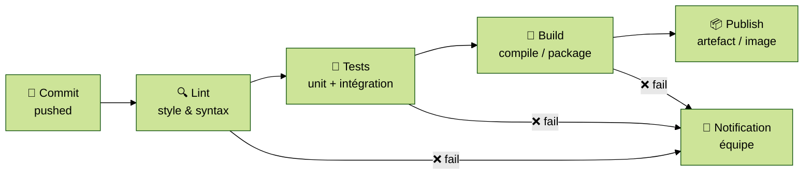

# Module 3 — Intégration Continue (CI)

---
level: 2
---

# Objectifs du module

- Comprendre la valeur et le principe de la CI
- Identifier les stages d'un pipeline CI générique
- Comprendre le concept de pipeline as code
- Mettre en place un premier pipeline sur un projet réel

---
level: 2
---

# Qu'est-ce que l'intégration continue ?

> La CI consiste à **intégrer les changements de code fréquemment** (plusieurs fois par jour), à **valider automatiquement** chaque intégration par un pipeline, et à **notifier rapidement** en cas d'échec.

<br/>

**Sans CI :** merge hell, "ça marchait sur ma machine", découverte des bugs tard, corrections coûteuses

**Avec CI :** feedback en minutes, qualité continue, confiance pour déployer souvent

<div class="mt-4 bg-blue-50 border-l-4 border-blue-500 p-4 rounded">
  💡 <strong>CALMS — Automatisation :</strong> tout ce qui peut être vérifié mécaniquement doit l'être automatiquement
</div>

---
level: 2
---

# Anatomie d'un pipeline CI



Chaque étape est indépendante, versionnée, reproductible. L'échec d'une étape bloque les suivantes.

---
level: 2
---

# Pipeline as code

Le pipeline CI est **un fichier texte versionné dans le dépôt**, au même titre que le code applicatif.

Avantages :
- Reviewable (PR, historique, diff)
- Reproductible sur n'importe quelle machine
- Évolution traçable

Chaque outil CI a son format :

| Outil | Fichier |
|---|---|
| GitHub Actions | `.github/workflows/*.yml` |
| GitLab CI | `.gitlab-ci.yml` |
| Bitbucket Pipelines | `bitbucket-pipelines.yml` |
| Jenkins | `Jenkinsfile` |
| CircleCI | `.circleci/config.yml` |

---
level: 2
---

# Structure d'un workflow CI (exemple GitHub Actions)

```yaml
# .github/workflows/ci.yml
name: CI

on:
  push:
    branches: [main, develop]
  pull_request:

jobs:
  lint-and-test:
    runs-on: ubuntu-latest
    steps:
      - uses: actions/checkout@v4
      - uses: actions/setup-node@v4
        with: { node-version: '20' }
      - run: npm ci
      - run: npm run lint
      - run: npm test

  build:
    needs: lint-and-test
    runs-on: ubuntu-latest
    steps:
      - uses: actions/checkout@v4
      - name: Build Docker image
        run: docker build -t app:${{ github.sha }} .
```

> Cet exemple illustre le TP. La structure `on / jobs / steps` est propre à GitHub Actions — chaque outil a ses équivalents.

---
level: 2
---

# Artefacts, cache et reproductibilité

**Artefacts :** fichiers produits par le pipeline (binaires, images Docker, rapports de tests) conservés pour les étapes suivantes ou téléchargés

**Cache :** répertoires réutilisés entre pipelines pour accélérer (ex: `node_modules`, cache Maven)
→ Toujours lier le cache à un hash du fichier de dépendances (`package-lock.json`, `pom.xml`)

**Matrice :** exécuter le même job sur plusieurs combinaisons (versions Node 18/20/22, OS Linux/Windows)

<div class="mt-4 bg-blue-50 border-l-4 border-blue-500 p-4 rounded">
  💡 Un build reproductible = même entrée → même sortie, partout, toujours (<strong>CALMS Lean</strong>)
</div>

---
level: 2
---

# Container Registry

Après le build, l'image Docker est **publiée dans un registre** accessible à l'étape de déploiement :

```
Développeur  →  Pipeline CI  →  Container Registry  →  Pipeline CD  →  Production
                               (images taguées)
```

Registres courants : Docker Hub, GitHub Container Registry (ghcr.io), GitLab Registry, Harbor, Scaleway Container Registry…

**Bonne pratique :** taguer avec le SHA du commit (`app:abc1234`) plutôt que `latest`

---
level: 2
---

# Bonnes pratiques — Intégration Continue

<div class="grid grid-cols-2 gap-4">

<div class="bg-green-50 border-l-4 border-green-500 p-3 rounded">
  <strong>✅ Faire</strong>
  <ul class="mt-2 text-sm">
    <li>Pipeline as code versionné → Automatisation (CALMS)</li>
    <li>Fail fast : lint avant tests → économise du temps CPU</li>
    <li>Build reproductible → Lean, élimine "ça marche chez moi"</li>
    <li>"Never leave the pipeline red" → Culture d'équipe (CALMS)</li>
    <li>Temps de pipeline cible : < 10 minutes</li>
  </ul>
</div>

<div class="bg-red-50 border-l-4 border-red-500 p-3 rounded">
  <strong>❌ Éviter</strong>
  <ul class="mt-2 text-sm">
    <li>Pipeline configuré uniquement dans l'UI</li>
    <li>Merger sans CI verte</li>
    <li>Tests flakey ignorés ("on verra plus tard")</li>
    <li>Pipeline > 30 min non optimisé</li>
    <li>Taguer toutes les images <code>latest</code></li>
  </ul>
</div>

</div>

---
level: 2
---

# TP 3 — Premier pipeline CI

> Outil utilisé dans ce TP : **GitHub Actions**. Les concepts (stages, artefacts, cache) s'appliquent à tout outil CI.

**Objectif :** créer un pipeline CI complet sur l'application fil rouge

```bash
cd devops-formation-app/02-ci-pipeline/
# Le fichier .github/workflows/ci.yml est déjà présent

# Observer la structure : jobs lint-and-test, build, publish
# Pousser une modification et observer l'exécution dans l'onglet Actions
git add .
git commit -m "feat: add CI pipeline"
git push origin feature/ci-pipeline
# Ouvrir une PR → observer le pipeline se déclencher
```

**À explorer :**
1. Faire échouer un test → observer la notification
2. Modifier le Dockerfile de l'app → vérifier que l'image se build bien
3. Constater le cache `node_modules` sur un second run

---
level: 2
transition: slide-right
---

# Débrief et validation

- Quelle étape de votre pipeline actuel prend le plus de temps ? Comment l'accélérer ?
- Pourquoi est-il dangereux de merger du code sans CI ?
- Quelle est la différence entre un artefact et un cache dans un pipeline ?
